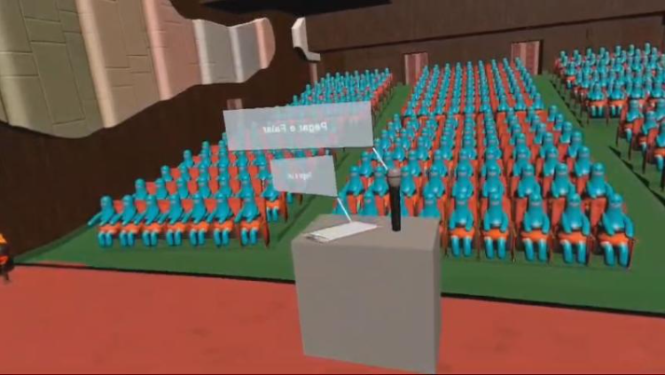
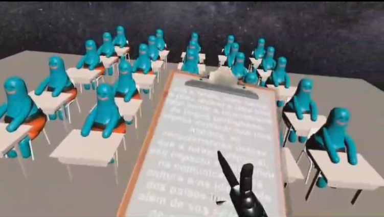
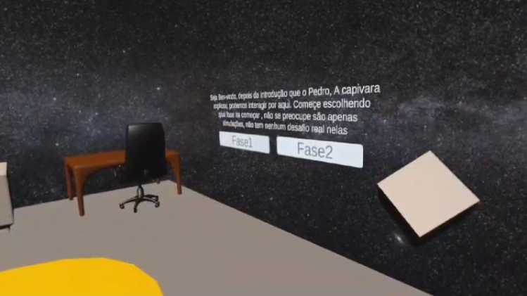

# 🎤 Projeto Glossofobia - Realidade Virtual para Treinamento de Apresentações

Este projeto foi desenvolvido em 2024 como parte da disciplina de **Realidade Virtual** no curso de **Ciência da Computação**. O objetivo é ajudar pessoas com **glossofobia** (medo de falar em público) por meio de simulações em **Realidade Virtual**, utilizando o **Oculus Quest 2** ou uma versão para **computador**.

A aplicação oferece um ambiente imersivo para treinar apresentações orais em cenários realistas e interativos.

---

## 📦 Instalação

Este projeto possui duas versões disponíveis para instalação:

### 🖥️ Versão para Computador (Windows)

1. Faça o download do instalador do projeto.
2. Execute o instalador e siga as instruções na tela.
3. Após instalado, inicie o aplicativo para começar a utilizar.

### 🕶️ Versão para Oculus Quest 2

1. Conecte seu Oculus ao computador com o modo de desenvolvedor ativado.
2. Utilize o instalador para realizar o sideload no Oculus Quest 2.
3. Após a instalação, o app estará disponível em sua biblioteca de "Fontes desconhecidas".

> ⚠️ **Atenção**: Caso as texturas fiquem com cores **azul ou rosa**, siga este [vídeo tutorial](https://www.youtube.com/watch?v=saa9zxgCMu4&list=PLpEoiloH-4eM-fykn_3_QcJ-A_MIJF5B9&index=3) e vá até o minuto `1:19`.

---

## 🧠 Objetivo

A proposta é proporcionar um meio de enfrentamento gradual da fobia social, permitindo ao usuário:

- Simular apresentações diante de uma plateia virtual.
- Desenvolver confiança e habilidades de oratória.
- Repetir e praticar diferentes tipos de discursos.

---
## 📸 Imagens do Projeto

| Cena do Jogo | Descrição |
|--------------|-----------|
|  | **Fase Teatro/Palestra.** Apresentação em Palestra, para quem passou no nível da escola pode ir nessa fase para testar como seria em palco. |
|  | **Fase Escola.** Apresentação em escola. |
|  | **Seleção de "Desafio".** Feito para escolher a fase de acordo com seu preparo. |

---

## 👨‍💻 Desenvolvedores

- **Paulo Ricardo Lopes Dionizio**
- **Fernando Toniza**
